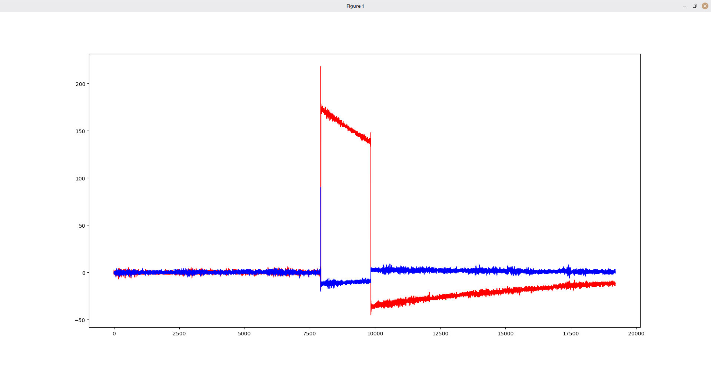

# Отчет по настройке ADALM-Pluto и программной генерации сигналов
### Неделя 3 (21.09 - 27.09)

## 1. Установка необходимых библиотек

Для работы с платой ADALM-Pluto в среде Linux (Mint) была произведена установка необходимых зависимостей и драйверов согласно методическому руководству.

Были скачаны и собраны из исходных кодов следующие компоненты (в строгой последовательности):

1. **libiio** — базовая библиотека для взаимодействия с аппаратными интерфейсами ввода-вывода.

2. **libad9361** — библиотека для управления RF-чипом AD9361, установленным внутри Pluto.

3. **SoapySDR** — абстрактный API и runtime библиотека для взаимодействия с различными SDR-устройствами.

4. **SoapyPlutoSDR** — модуль-плагин (драйвер), связывающий SoapySDR с ADALM-Pluto.

Сборка производилась стандартными средствами CMake: `mkdir build`, `cd build`, `cmake ../`, `make`, `sudo make install`. Процесс прошел успешно, все библиотеки были корректно скопированы в системные папки (несмотря на визуальные особенности темы терминала, вроде желтых крестиков `✗`, обозначающих лишь статус репозитория Git).

## 2. Проблемы при сборке проекта и их решения

В процессе написания собственного C++ кода для генерации сигнала и его сборки через скрипт `run.sh` мы столкнулись с рядом проблем, которые были успешно решены:

1. **Неверный путь к исходному файлу в CMakeLists.txt**

   * **Ошибка:** `Cannot find source file: dev/main.cpp`.

   * **Причина:** Так как файл `CMakeLists.txt` уже находился в папке `dev`, путь `dev/main.cpp` заставлял систему искать файл в несуществующей подпапке `dev/dev/`.

   * **Решение:** Путь в `CMakeLists.txt` был изменен просто на `main.cpp`.

2. **Отсутствие поддержки C++ в CMake**

   * **Ошибка:** `Cannot determine link language for target "main"`.

   * **Причина:** В настройках проекта был указан только язык Си (`project(PlutoSDR C)`), в то время как исходный файл имел расширение `.cpp`.

   * **Решение:** В `CMakeLists.txt` добавлена поддержка C++: `project(PlutoSDR C CXX)`.

3. **Предупреждения компилятора о несовпадении типов (-Wsign-compare, -Wformat)**

   * **Причина:** Сравнение знакового типа `int` с беззнаковым `size_t`, а также использование неверного ключа форматирования `%d` в `printf`.

   * **Решение:** Типы счетчиков циклов заменены на `size_t`, а в `printf` использован ключ `%zu`.

4. **Ошибка запуска бинарного файла**

   * **Ошибка:** `sudo: ./main: команда не найдена`.

   * **Причина:** Попытка запустить исполняемый файл из корневой директории `dev`, хотя CMake поместил скомпилированный файл в директорию `build`.

   * **Решение:** Переход в папку сборки `cd build` перед запуском программы.

5. **Плата не обнаружена кодом**

   * **Ошибка:** `SoapySDRDevice_make fail: failed to get usb device interface name`.

   * **Причина:** В коде был жестко прописан некорректный URI `"usb:"`.

   * **Решение:** С помощью утилиты `SoapySDRUtil --find` был определен сетевой адрес устройства. В коде `main.cpp` адрес был заменен на `"ip:pluto.local"`, что обеспечило стабильное подключение.

## 3. Генерация прямоугольного сигнала (Стоковый вариант)

В исходном варианте кода происходило заполнение буфера константным значением. Цикл проходил по всему массиву и в каждую ячейку `I` и `Q` каналов записывал максимальную амплитуду `2000`.

Из-за мгновенного перескока значения с 0 (отсутствие сигнала до отправки буфера) до 2000, удержания этого уровня на протяжении всего буфера и резкого обрыва в конце, на графике (отрисованном с помощью Python-скрипта `readPcm.py`) мы получили классический прямоугольный импульс.



## 4. Генерация трапециевидного сигнала (Персональное задание)

Для выполнения индивидуального задания требовалось изменить форму цифрового сигнала с прямоугольной на трапециевидную. Для этого мы отказались от заливки буфера одной константой и разделили его размер (`N = tx_mtu`) на три логические части:

1. **Зона плавного нарастания (фронт):** Занимает 1/4 буфера. Значения линейно растут от 0 до 2000.

2. **Зона плато:** Занимает 2/4 буфера. Значения держатся на максимальном уровне 2000.

3. **Зона плавного спада (срез):** Занимает оставшуюся 1/4 буфера. Значения линейно падают от 2000 обратно к 0.

**Реализация в коде:**

```cpp
// Параметры трапециевидного сигнала
size_t N = tx_mtu;           
size_t ramp_samples = N / 4; 
int32_t max_amp = 2000;      

// Заполнение буфера tx_buff формой трапеции
for (size_t i = 0; i < N; i++)
{
    int16_t amp = 0;
    
    if (i < ramp_samples) {
        amp = (int16_t)((max_amp * i) / ramp_samples);
    } 
    else if (i < N - ramp_samples) {
        amp = max_amp;
    } 
    else {
        amp = (int16_t)((max_amp * (N - 1 - i)) / ramp_samples);
    }

    tx_buff[2 * i] = amp;       // I-компонента
    tx_buff[2 * i + 1] = amp;   // Q-компонента
}
```

Результат выполнения данного алгоритма, зафиксированный приемником платы, представлен на графике ниже. Форма сигнала успешно изменена на трапециевидную.


